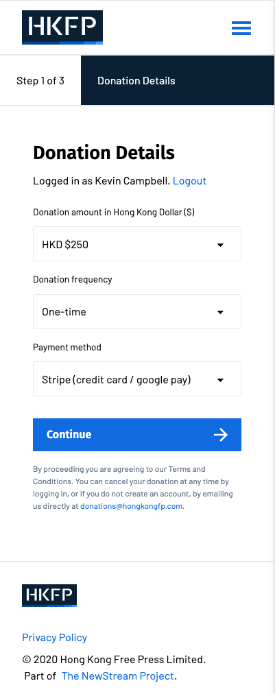
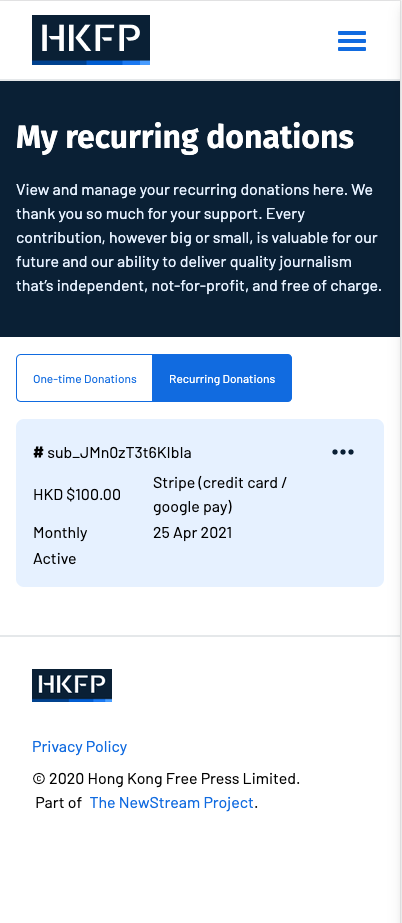
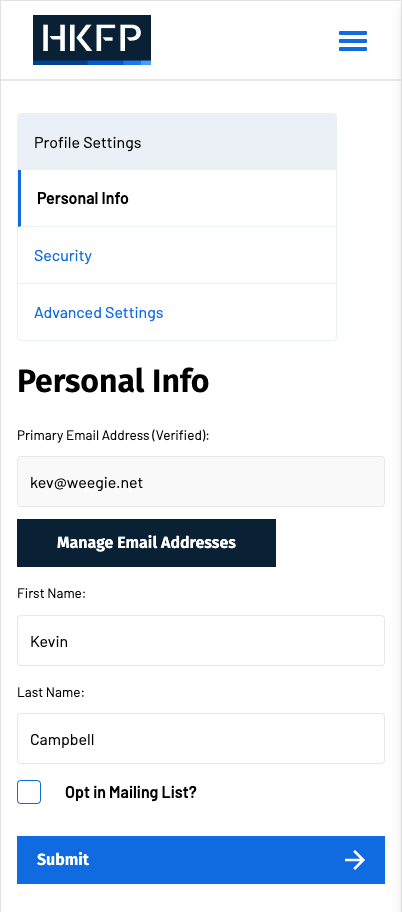
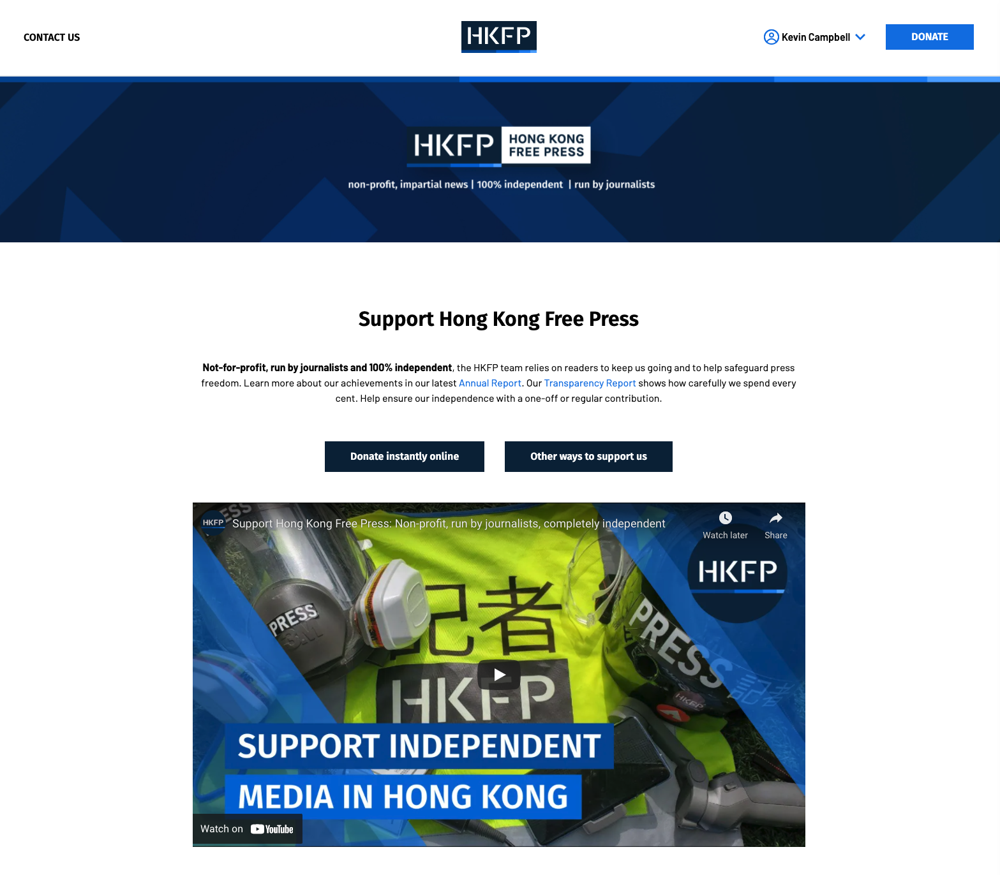

Newstream
==========

Newstream is a fundraising and donation management system, designed for news organisations and NGOs. It was created
thanks to funding from the [Google News Initiatitve (GNI)](https://newsinitiative.withgoogle.com/). It allows users
to perform one-off donations, or set up recurring payments to your organisation. The portal allows donors to manage
their subscrption, view past donations, and update their personal details.

The system runs as a standalone web application, independent of your main web presence. This avoids compatibility
or security issues which may be found with donation plugins. The system is self-contained, and can be installed
by non-technical users, by following the documentation.

Screenshots
-----------

Features
---------

- End user portal for donors (subscription settings, receipts, password management)
- Reporting and donor management via admin site
- Social media and oauth signup (twitter, google, facebook)
- Modular payment gateways (stripe, paypal, 2c2p)
- Fully customisable interface (css, templates)
- Translations / i18n support
- Basic email campaign and communication functionality

Project Home
------------
https://github.com/diffractive/newstream

Documentation
-------------
https://newstream.readthedocs.io/en/latest

Slack
------------
https://diffractivehk.slack.com/channels/newstream

