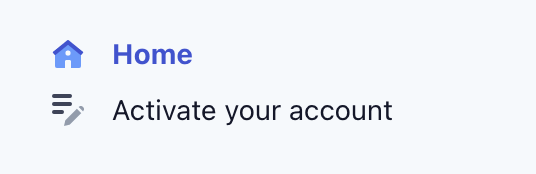
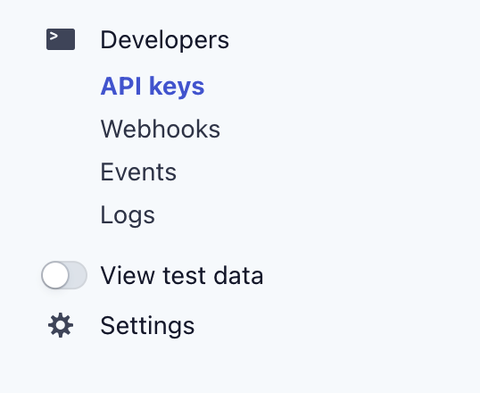
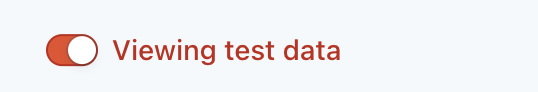
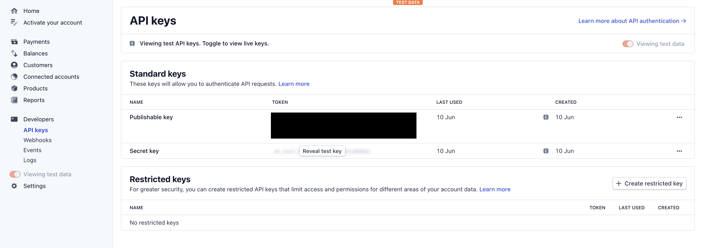
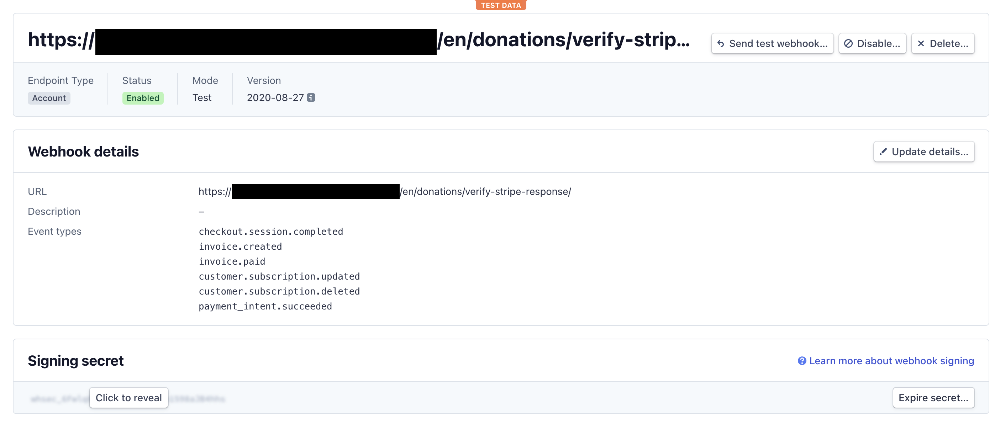
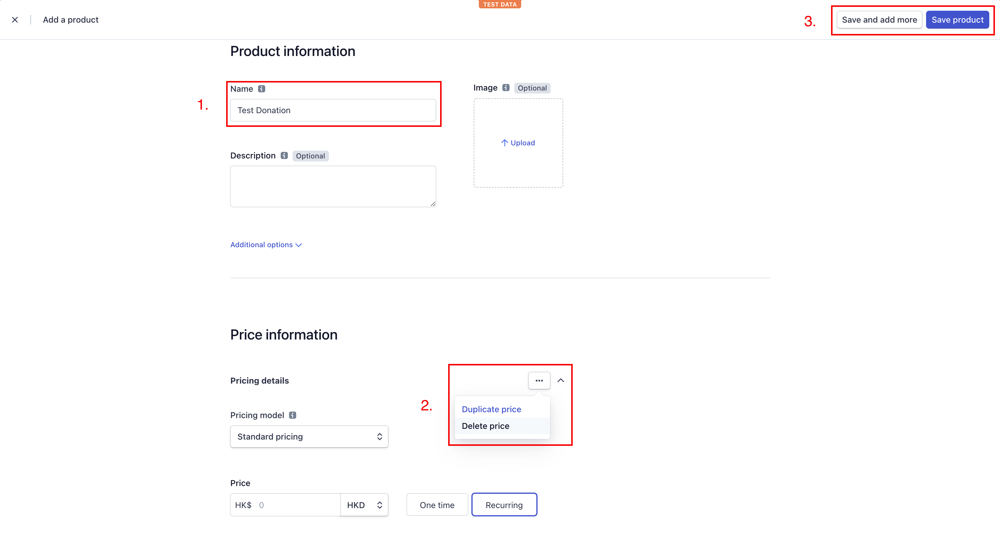
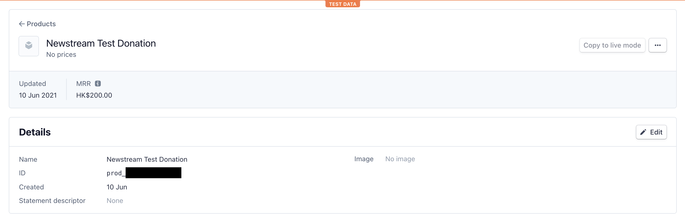
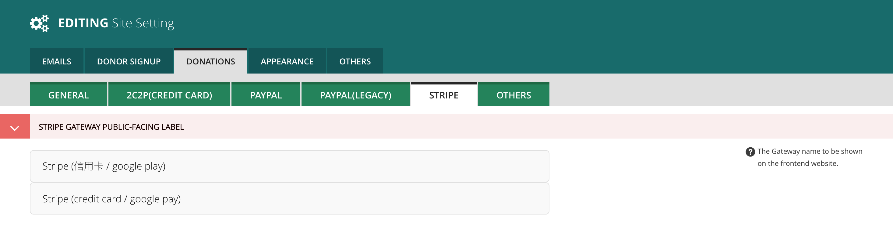
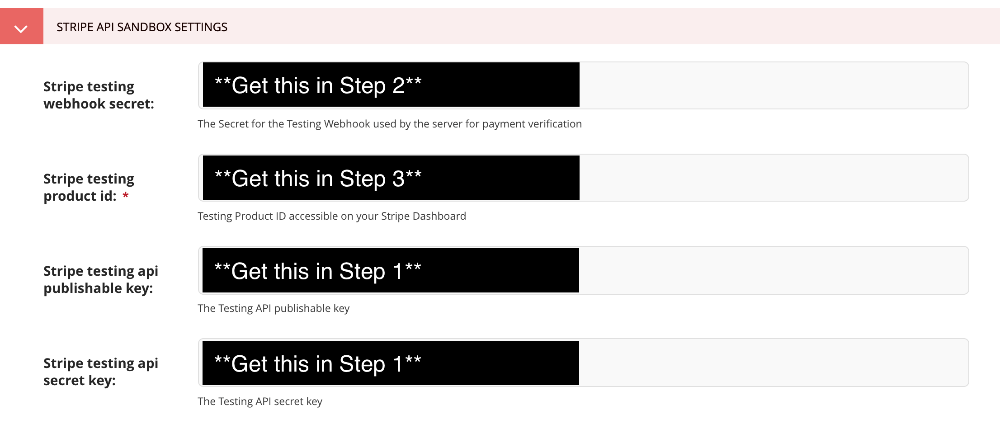
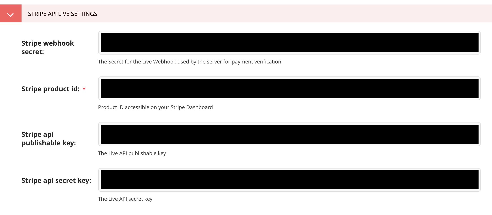

.. _configuration:

*************
Configuration
*************

Homepage Customisation
======================

Payment Gateways
================

Stripe
------

**Prerequisites**

You need to have a Stripe account. First, sign up at https://stripe.com/. After you are logged in, go to your Stripe dashboard at https://dashboard.stripe.com/. 

You can skip activating your account at first. You only have to activate your account when you are ready to set up Stripe for production use because you are limited to viewing test data only if your account hasn't been activated yet.

**Test/Live Mode**

Before you set up your Stripe account for Newstream, you need to make sure whether you are viewing **live data** or **test data** in the Stripe dashboard.

If you are setting up Stripe for your Newstream site's staging environment, then toggle ``View test data`` on. If you are setting up for the production environment instead, then toggle ``Viewing test data`` off.

The **setup steps below are the same either in Test/Live mode**. When you have ``View test data`` on, every data you are seeing or have created in the dashboard belongs to the Test mode only, vice versa for the Live mode.

**Step 1: Getting your API keys**

Click ``Developers > API Keys`` in the side navigation to view your API keys. This is where you will get the publishable key and the secret key that have to be filled in your Site Setting at Newstream.

**Step 2: Setting up a Webhook**

Go to ``Developers > Webhooks`` in the side navigation to view all webhooks(or endpoints). Click ``+ Add endpoint`` on the top right and a modal form will pop up.

Your ``Endpoint URL`` should point to https://your-newstream.com/en/donations/verify-stripe-response/

Newstream will need these 6 events only for all Stripe transactions to run smoothly:

* payment_intent.succeeded
* customer.subscription.deleted
* customer.subscription.updated
* invoice.paid
* invoice.created
* checkout.session.completed

.. image:: images/stripe-add-webhook.png
  :width: 400
  :alt: Stripe adding a webhook

Once your webhook is created, you should see the confirmation page and the signing secret just below the webhook details.

**Step 3: Create a Product**

Newstream needs a generic Stripe product to use for creating donations. This product does not need to have pricing on its own, as Newstream generates pricing automatically when donations are made.

Go to ``Products`` in the side navigation and click ``+ Add product`` on the top right. 

In the "Add a product" page, enter a suitable Name(product name will be shown on the Stripe checkout page), and remove the pricing. Once complete, click ``Save product`` on the top right.

Once the product is created, note the product id, as you will need to input this in the Site Setting at Newstream.

**Step 4: Configure Site Setting at Newstream**

Log into your Newstream admin site at https://your-newstream.com/admin, then go to ``Settings > Site Setting`` in the side navigation. In the "Site Setting" page, go to the ``DONATIONS > STRIPE`` tab.

.. image:: images/stripe-site-setting.png
  :width: 400
  :alt: Stripe site setting

Scroll down and you will see a ``STRIPE API SANDBOX SETTINGS`` section and a ``STRIPE API LIVE SETTINGS`` section. If you set up Stripe in Test mode, then copy the keys and secrets to the input boxes under the Sandbox section. If you set up Stripe in Live mode, then fill in the keys and secrets under the Live section.

Finally, click ``SAVE`` at the bottom to save your Stripe settings. Now your Newstream site's Stripe payment gateway should be working.

----

Paypal
------
