.. _installation:

*************
Installation
*************

Google Cloud
============

The simplest way to deploy Newstream is via Google Cloud. Using Google Cloud Run we can deploy newstream
as a docker container. Costs are relatively low, and will reduce in future updates as we optimise components.

----

.. _google-cloud-pricing:

Pricing
-------

These prices are all estimates, based on the current prices for the ap-southeast1 region (singapore). We run an idle instance as part of the current configuration - future updates should remove the need for this. Note there are some additional small costs which are not covered here (network traffic, backups, google cloud build, google storage, etc). These are all assumed to be negligible.

**Google Cloud Run**

| Idle instance CPU 1 x 0.00000250 * (60 * 60 * 24) * 365 → $78.84 USD / pa
| Idle instance Memory 0.5 x 0.00000250 * (60 * 60 * 24) * 365 → $39.42 USD / pa

**Google Cloud SQL**

| 10 GB storage HDD 10 x 0.126 x 12 → $15.12 USD / pa
| Instance cost (db-f1-micro) 12 x 10.73 → $128.76 USD / pa

**Email Service (Mailgun)**

| Assuming 10000 emails per year - $0.80 / 1000 emails → $8 USD / pa

| **Total annual cost: $270.14 USD / pa**
| *(78.84 + 39.42 + 15.12 + 128.76 + 8)*

----

.. _google-cloud-installation-steps:

Installation Steps
------------------

The simplest way to deploy Newstream is via Google Cloud. You will need to configure the following

* :ref:`setup-google-cloud-project`
* :ref:`setup-google-cloud-sql`
* :ref:`setup-google-secret-manager`
* :ref:`setup-mailgun`
* :ref:`setup-google-cloud-run`

Once the site is up and running, there is some additional configuration you can apply

* Domain Mapping (essential)
* Google Cloud Storage (optional)

And if you wanting to customise newstream, beyond what is possible via the admin interface, please see

* Google Container Registry (optional)
* Building custom images
* Deploying custom images

----

.. _setup-google-cloud-project:

Google Cloud Project
--------------------

Sign up for Google Cloud at https://cloud.google.com/

Create a new project to deploy newstream. We recommend that you create a “Newstream Staging” project first to test everything out, before setting up “Newstream Production”. 

You can keep the staging project to test any future changes / upgrades before updating production.

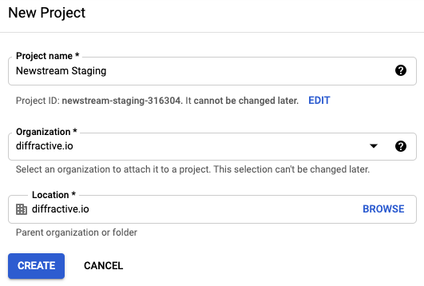

----

.. _setup-google-cloud-sql:

Google Cloud SQL
----------------

The Google Cloud SQL database will hold all of your user data, as well as the site configuration and page content. We chose the lowest cost options available.

If you are wanting additional performance or reliability, you may want to adjust some of the settings here. Given the nature of the system (infrequent usage, low concurrency) it’s unlikely that this is required.

Go to `Database > SQL` from the Google Cloud console and choose to create an instance

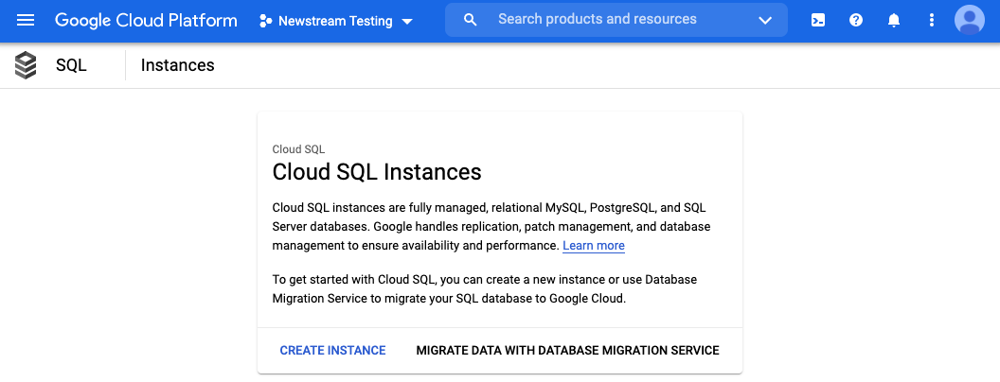

We want to use PostgreSQL as the database backend

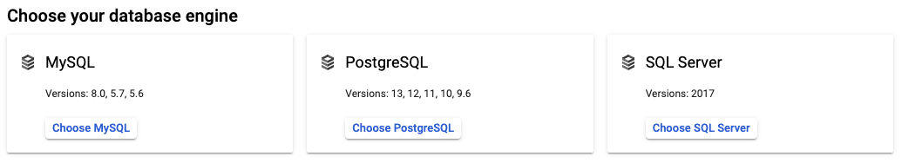

Enter the instance details

* Instance ID: newstream-db
* Password: Generate from interface, but you don't need to copy this

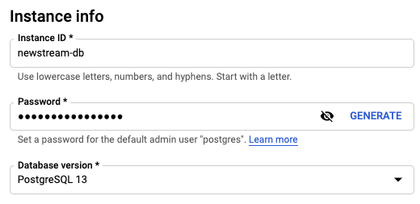

Set the region you are deploying to. Note that we don’t enable high availability, as it increases the cost significantly.

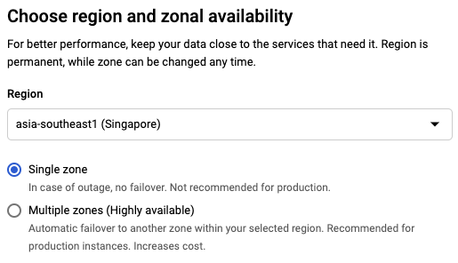

Under *Customise your instance* choose *Show Configuration Options* to set the next two

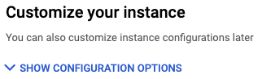

Set the storage to 10GB on HDD

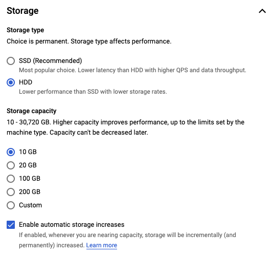

Set the machine type to “Shared core” with 1vCPU and 0.614GB of RAM

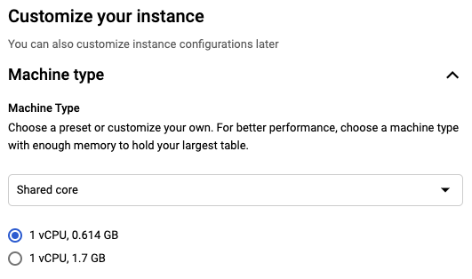

All other settings can be left as default. Now that the instance is running, you will need to create a database. Go to Databases > Create Databaseand create the newstream database

Finally, you need to create a user account. Go to `Users > Create User` and create a user newstream. Enter a randomly generated password, and save this for later - you will it when adding secrets to Google Secret Manager

----

.. _setup-google-secret-manager:

Google Secret Manager
---------------------

Secret Manager is used to securely store passwords and API keys. You will need to create the following secrets

* secret_key - randomly generated secret value to secure web pages and forms - see below
* database_password - the password you recorded when you created the Google Cloud SQL database
* admin_password - a password of your choice for the admin site
* email_host_password - the connection password provided by mailgun

To add a secret, choose Create Secret and then enter the secret details. You only need to set the name and the secret value, all other options can be left as default 

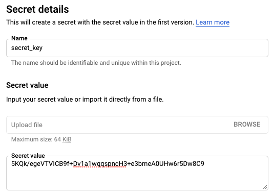

Once you have added all secrets, you should see the following list

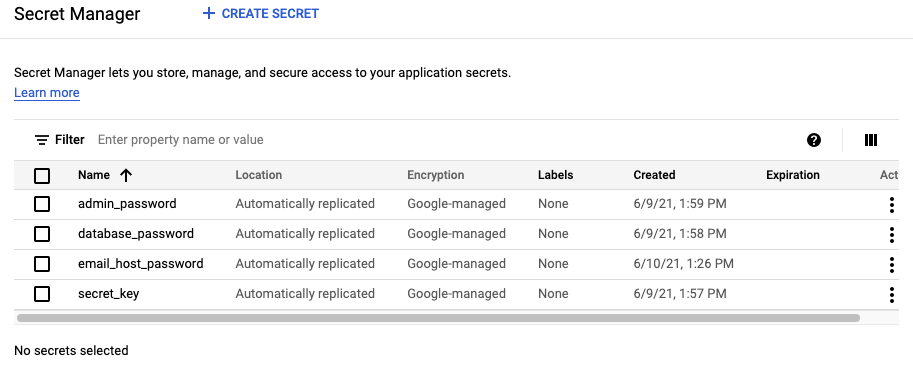

**secret_key**

On OSX, pasting the following into your terminal will generate a suitable secret key

.. code-block:: sh
   
   base64 /dev/urandom | head -c50 | tr '\n' ' ' && echo " "

For other operating systems, you may want to use the `Javascript Key Generator <https://asecuritysite.com/encryption/js01>`_  to generate a key via your browser. Choose “Hexadecimal” and generate a new secret

----

.. _setup-mailgun:

Mailgun
-------

There are multiple email providers available for sending email. See https://cloud.google.com/compute/docs/tutorials/sending-mail for more details.
Other options recommended by Google are

* Sendgrid
* Mailgun
* Mailjet
* Google Workspace

Mailgun is a good option for medium volume sites due to it's pay as you go pricing model. Other services are free, but only for a limited number of
emails per day, which may cause problems during fundraising campaigns if a large number of donors register at once. Note that Google Workspace isn't
free as it requires a user account to be configured.

Sign up via https://www.mailgun.com/. Once logged in, go to to Sending > Domains > Add New Domain

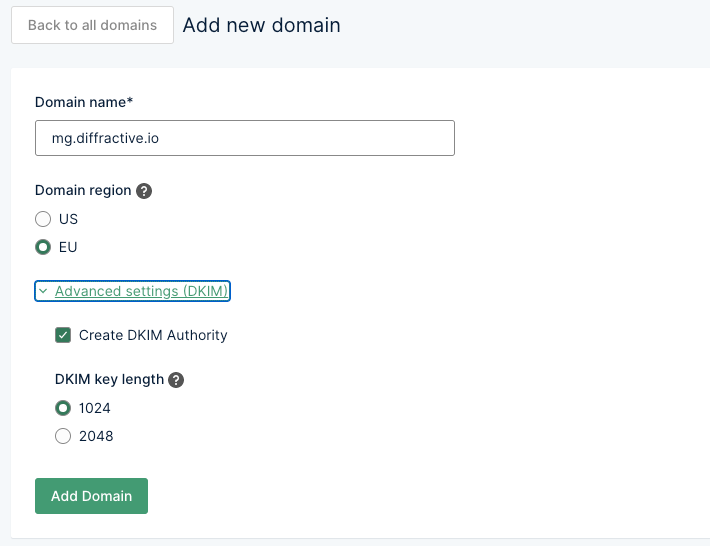

You should register `mg.yourdomain.com` as recommended. You can leave the DKIM settings (under advanced settings) as default. You will now need to configure the DNS settings for your domain. As there are a number of different DNS providers, you will need to follow Mailgun's instructions for configuring this. Once you've managed to finish configuring DNS and have verified the settings, Mailgun will ask you how you want to configure your domain.

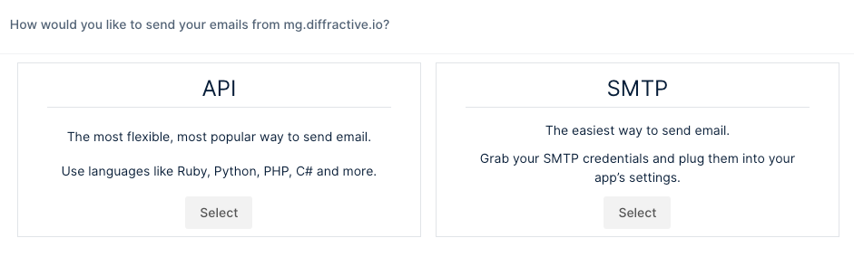

Choose the SMTP option. Mailgun should show you details for your SMTP connection.

* SMTP hostname: smtp.eu.mailgun.org
* Port: 587 (recommended)
* Username: postmaster@mg.diffractive.io
* Default password: XXX

Take a note of the username, SMTP hostname and password. You will need these later when setting up Google Secret Manager and configuring your Google Cloud Run instance.

----

.. _setup-google-cloud-run:

Google Cloud Run
----------------

Now you are ready to deploy and run the newstream instance. Go to `Cloud Run` from the Google Cloud console and choose `Create Service`. Enter the Service Name (newstream) and choose your region

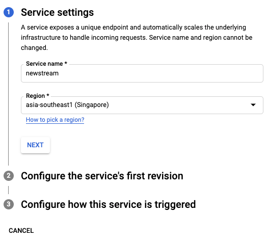

Choose the container image. You can use `gcr.io/diffractive/newstream` which is the public container image on Google Cloud for newstream.

You will also need to configure the Advanced Settings

**Container**

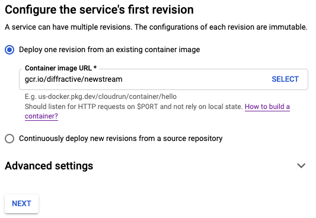

* Container port: 8000
* Minimum number of instances: 1

**Variables & Secrets**

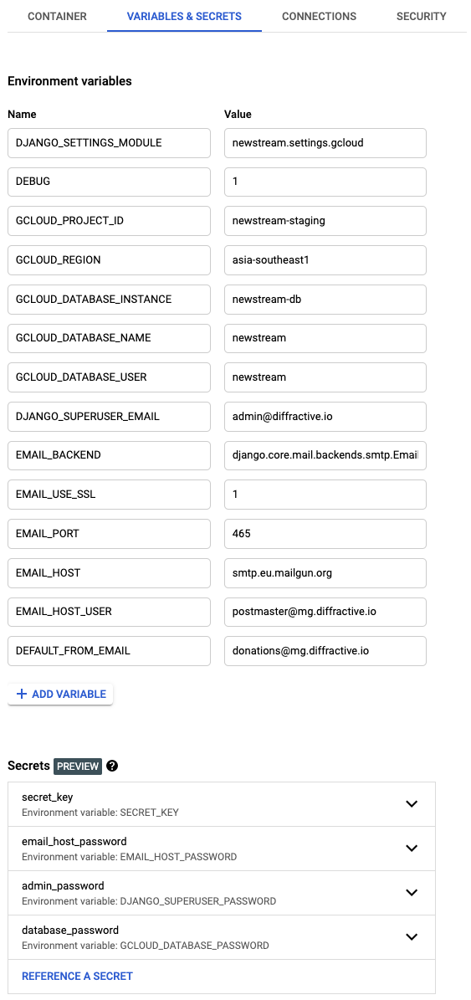

There are quite a few variables to set here. See the :ref:`setup-docker-env-reference` for details all of variables which can be set. For the full list which is required for now, refer to the screenshot.

There are some variables which need to be exposed from Google Secret Manager. You will have configured these earlier in the :ref:`setup-google-secret-manager` section of this documentation. Use "Exposed as environmental variables" for these and set the Version to "latest".

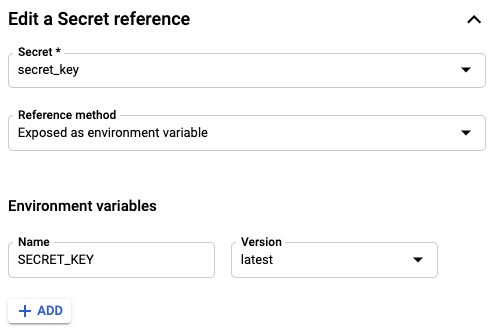

**Connections**

Add the connection the database instance you created earlier (newstream-db) and enable the cloud sql admin API

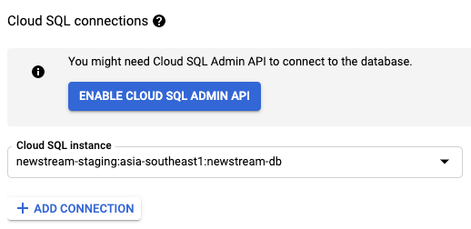

Finally, for the last step, enable “Allow unauthenticated invocations” as this is a public website

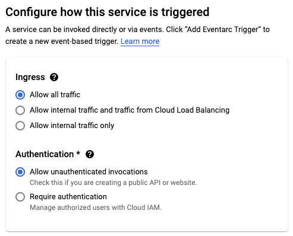

If everything has gone successfully, you should see a green tick showing the deployment completed, and the URL to log into the site.

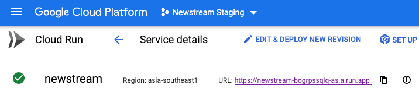

Click on the URL to view your new installation. You can now access the admin page and start configuring and testing.

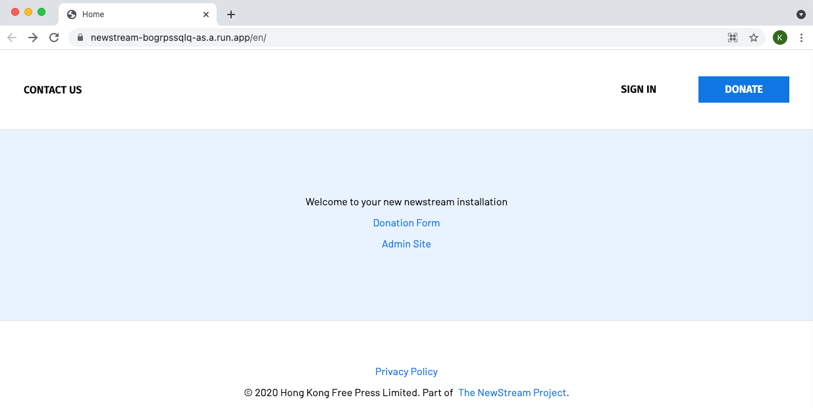

----

.. _setup-docker-env-reference:

Docker Env Reference
====================

.. flat-table:: Docker Parameters
   :widths: 50 25 50 50
   :header-rows: 1

   * - :cspan:`3` Global Settings
   * - Variable Name
     - Sensitive
     - Example Value
     - Default
   * - DJANGO_SETTINGS_MODULE
     - No
     - newstream.settings.gcloud
     - 
   * - SECRET_KEY
     - Yes
     - fhfb37dg3yv
     -

   * - :cspan:`3` **Admin Account Creation**
   * - DJANGO_SUPERUSER_EMAIL
     - No
     - admin@diffractive.io
     -
   * - DJANGO_SUPERUSER_PASSWORD
     - Yes
     - groebge94bf
     -

   * - :cspan:`3` **Gcloud Project Details**
   * - GCLOUD_PROJECT_ID
     - No
     - axiomatic-math-314909
     -
   * - GCLOUD_REGION
     - No
     - asia-southeast1
     -

   * - :cspan:`3` **Google Database Settings**
   * - GCLOUD_DATABASE_INSTANCE
     - No
     - newstream-db
     - newstream-db
   * - GCLOUD_DATABASE_NAME
     - No
     - newstream
     - newstream
   * - GCLOUD_DATABASE_PASSWORD
     - Yes
     - DFf93fbjdgfuVFHDsd1f
     - 

   * - :cspan:`3` **Google Storage Settings**
   * - GCLOUD_BUCKET_NAME
     - No
     - newstream.diffractive.io
     - 

   * - :cspan:`3` **Email Settings**
   * - EMAIL_BACKEND
     - No
     - django.core.mail.backends.smtp.emailbackend
     - 
   * - EMAIL_USE_SSL
     - No
     - 1
     - 0
   * - EMAIL_USE_TLS
     - No
     - 1
     - 0
   * - EMAIL_PORT
     - No
     - 465
     - 25
   * - EMAIL_HOST
     - No
     - smtp.eu.mailgun.org
     - 
   * - EMAIL_HOST_USER
     - No
     - postmaster@mg.diffractive.io
     - 
   * - EMAIL_HOST_PASSWORD
     - Yes
     - doub23f89fbi32f
     - 
   * - DEFAULT_FROM_EMAIL
     - No
     - donations@diffractive.io
     - 

   * - :cspan:`3` **System Settings**
   * - RUN_MIGRATIONS
     - No
     - 1
     - 1
   * - COLLECTSTATIC
     - No
     - 1
     - 1
